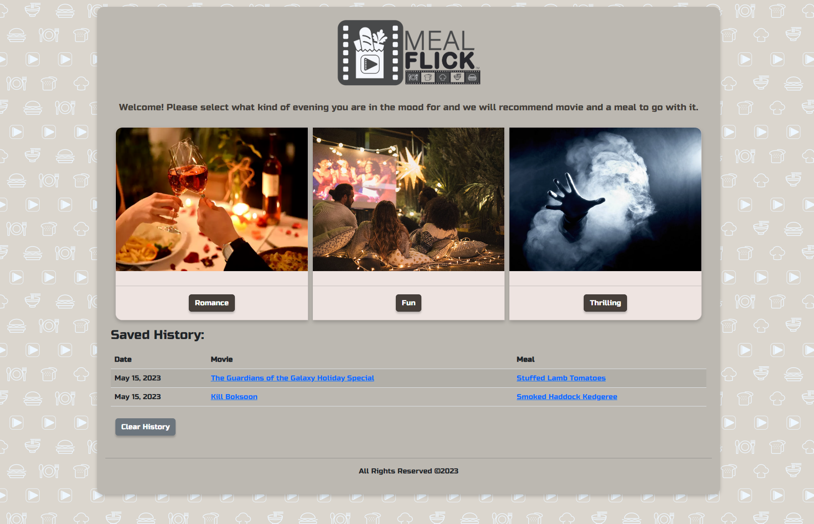
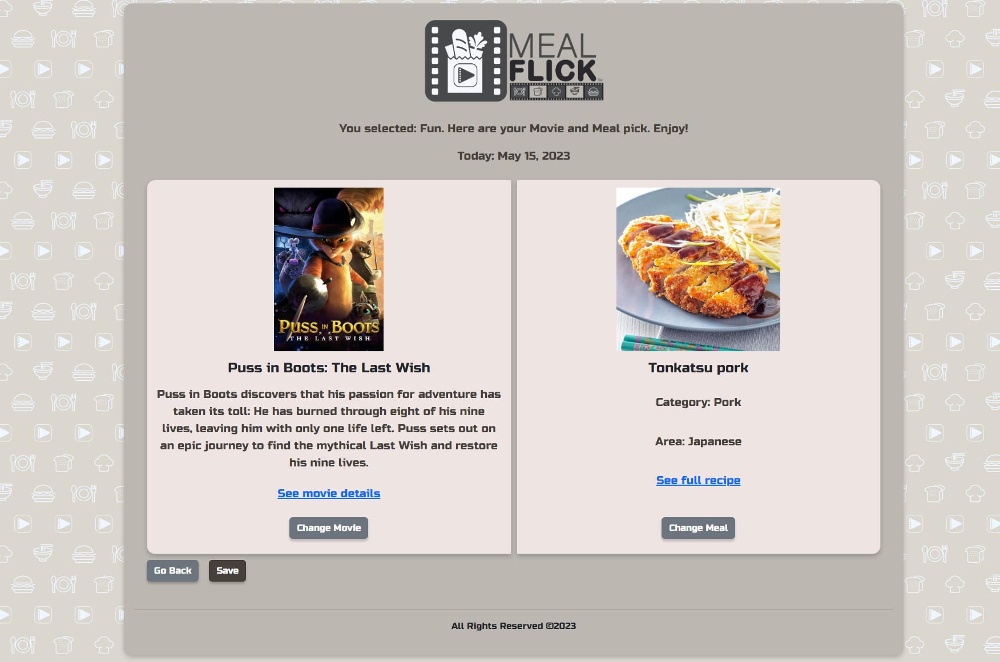

# MealFlick

## Description

MealFlick is a web-application that uses server-side third-party API's, The Movie Database and TheMealDB, to dynamically generate movie and meal recipe option based on the users mood (Romantic, Fun or Thrilling). The app has an option for user to save movie and meal combination using Local Storage to revisit later. 
This web application runs in the browser and features dynamically updated HTML, Bootstrap CSS framework, custom CSS and JavaScript powered by jQuery.

- When user opens MealFlick web-application, they can select what kind of mood they are in. 
- User can also see previously saved history on the homepage.  
- When user clicks on one of the mood options (Romantic, Fun or Thrilling), then they are presented with Movie and Meal Recipe option on the next page.
- Each movie and meal has a link to outside source for more details and full recipe. 
- User can then change movie or meal individually until perfect match is found. 
- Once user makes final selection, they can click "Save" button to save Movie and Meal data.
- Go Back option on generated page will redirect user back to the homepage.
- Saved history on homepage has links for movie and recipe detail pages. 

## Usage

Web application is located at: https://vlada-caban.github.io/meal-flick/

Screenshot of the homepage with saved search history:

Example of generated page with Movie and Meal combination: 

## Credits

- Bootstrap was used for styling.
- Day.js library was used for date.
- The Movie Database API (https://www.themoviedb.org) was used to retrieve movie data
- TheMealDB API (https://www.themealdb.com/api.php) was used to retrieve recipe data
- Google Fonts used for font.

## License

Please refer to the LICENSE in the repo.